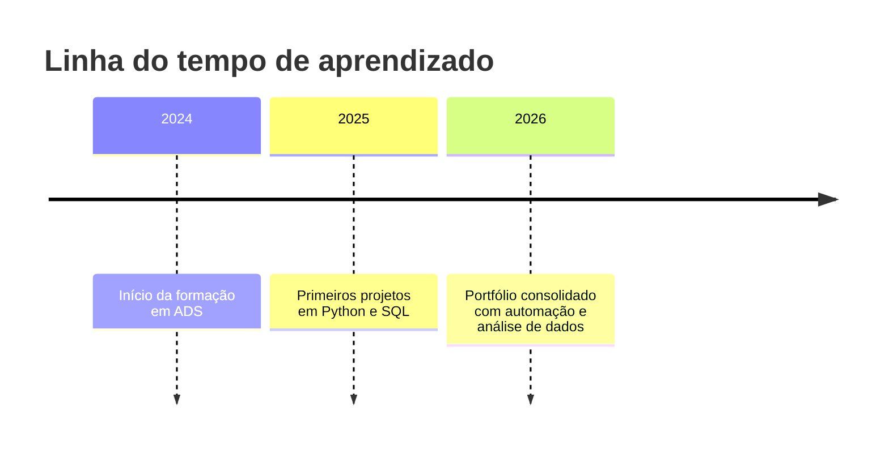
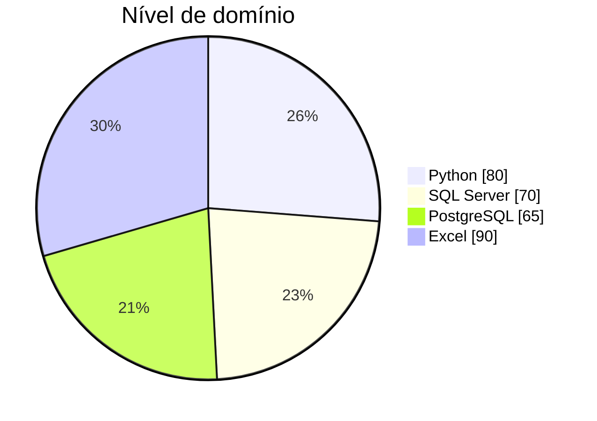

  

#  Sobre mim
Sou profissional com experiência em rotinas administrativas, gestão documental e suporte operacional, atualmente em formação em Análise e Desenvolvimento de Sistemas. Estou construindo um portfólio que une minha vivência administrativa com habilidades em análise de dados e automação de processos.

## 📊 O que você vai encontrar aqui
- Projetos em Excel aplicados à gestão administrativa e análise de informações  
- Automação de relatórios e processos com Inteligência Artificial  
- Exercícios e aplicações em Python e SQL (Microsoft SQL Server / SSMS) voltados para análise de dados  
- Projetos acadêmicos que demonstram minha evolução em programação e banco de dados  

## 🎯 Objetivo
Conectar minha experiência como Assistente Administrativo com ferramentas modernas de análise de dados, apoiando empresas na tomada de decisão e na otimização de processos internos.

---

## 🛠️ Tecnologias

| Python | SQL Server | PostgreSQL | MySQL |
|--------|------------|------------|-------|
|  |  |  |  |

---

## 🏷️ Badges

---

## 🚀 Projetos em destaque
- 📊 **Dashboard Administrativo em Excel** – relatórios dinâmicos para gestão documental.  
- 🤖 **Automação de Relatórios com IA** – scripts que reduzem tempo de tarefas repetitivas.  
- 🐍 **Python + SQL** – análises de dados integrando Python e SQL Server.  
- 🎓 **Projetos Acadêmicos** – evolução em programação e banco de dados.  

---

## 📈 Minha evolução 

## 📊 Habilidades

