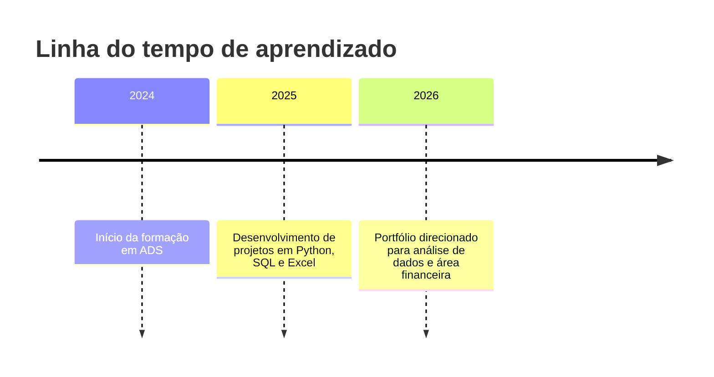
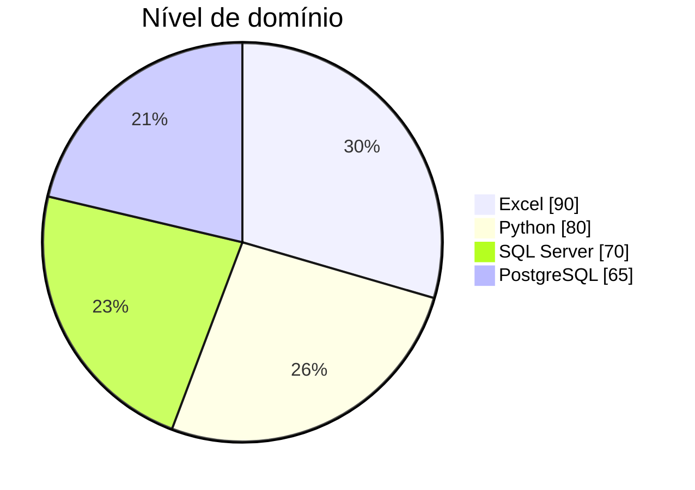

  

#  Sobre mim

Sou profissional com experiência em rotinas administrativas, gestão documental e suporte operacional, com formação em tecnologia voltada à análise de dados e automação de processos.

Atuo na construção de soluções que unem organização administrativa, análise de informações e otimização de processos, com foco em geração de valor para o negócio.

---

## 💼 Foco profissional

Atuação direcionada para áreas administrativas e financeiras, utilizando ferramentas de análise de dados para apoio à tomada de decisão, controle de processos e otimização de rotinas.

---

## 📊 O que você vai encontrar aqui

* Projetos em Excel aplicados à gestão administrativa e financeira
* Desenvolvimento de dashboards e relatórios para análise de dados
* Automação de processos com Python
* Aplicações com SQL voltadas para tratamento e análise de dados
* Projetos que demonstram a integração entre administração e tecnologia

---

## 🎯 Objetivo

Aplicar minha experiência administrativa aliada à análise de dados para contribuir com a organização, controle e otimização de processos, apoiando a tomada de decisão nas empresas.

---

## 🛠️ Tecnologias

| Excel | Python | SQL Server | PostgreSQL | MySQL |
|-------|--------|------------|------------|-------|
|  |  |  |  |  |
---

## 🏷️ Badges

---

## 🚀 Projetos em destaque

* 📊 **Dashboards em Excel para análise administrativa e financeira**
  Criação de relatórios dinâmicos com foco em tomada de decisão e visualização de dados.

* 💰 **Controle financeiro e análise de fluxo de caixa**
  Organização de contas, acompanhamento de receitas e despesas e análise de indicadores financeiros.

* 🤖 **Automação de processos com Python**
  Desenvolvimento de soluções para reduzir tarefas repetitivas e aumentar a produtividade.

* 🐍 **Análise de dados com Python e SQL**
  Integração, tratamento e análise de dados para geração de insights.

---

## 📈 Minha evolução

```mermaid
timeline
title Linha do tempo de aprendizado
2024 : Início da formação em ADS
2025 : Desenvolvimento de projetos em Python, SQL e Excel
2026 : Portfólio direcionado para análise de dados e área financeira
```

---

## 📊 Habilidades

```mermaid
pie showData
    title Nível de domínio
    "Excel" : 90
    "Python" : 80
    "SQL Server" : 70
    "PostgreSQL" : 65
```
